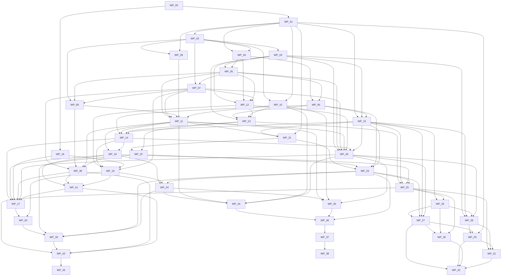

# Work-package catalog and dependency graph

**Texenda implementation handoff 1.1.0 · 2026-09-05 · NORMATIVE**

MUST/MUST NOT are binding; SHOULD requires a recorded reason to depart; MAY permits but does not commit scope. Source: Accepted interaction architecture and complete-handoff directive. Apply [package authority](../DECISION-STATUS.md).

This is the generated reading view of [work-packages.json](work-packages.json). Work contracts are bounded, not automatic authorization for all optional features or external effects. Activation gates differ from synthetic-build prerequisites.

## Dependency graph

## Assignment contracts

### WP-00 — Bootstrap runtime and evidence workspace

**Phase:** PH-00 · **Risk:** medium · **Execution tier:** 2 · **Review tier:** 2

Inspect the actual coding runtime, establish owner budget and tier mappings, install harness in an empty repository, and record environment without credentials.

**Scope/output:** Runtime-qualified roster or explicit unavailable tiers; read-only local probe; compatibility inventory; task evidence layout. No application code or external mutation.

**Dependencies:** 

**Write scope:** AGENTS.md; specs/texenda-handoff; tooling; docs/qualification; .codex; .gitignore

**Expected outputs:** Runtime-qualified roster or explicit unavailable tiers.; read-only local probe.; compatibility inventory.; task evidence layout. No application code or external mutation..

**Done when:** Runtime probe cannot leak credentials or imply model access from public docs; Unverified tiers remain unusable; unavailable tiers are explicit; Harness install/dry-run and self-tests pass in a clean directory

**Activation gates:** 

**Verification:** Run relevant unit/integration/security tests and report exact commands, outcomes and environment; Bind all test evidence and review to candidate revision and artifact hashes; Report NOT RUN honestly; unavailable provider/production evidence is not a passing test

**Handoff:** Changed files/commit and contract revisions; Acceptance evidence paths and hashes; Unresolved risks, rejected approaches and safe resumption checkpoint

**Read:** [product-and-brand.md](../01-foundation/product-and-brand.md), [invariants.md](../01-foundation/invariants.md), [DECISION-STATUS.md](../DECISION-STATUS.md), [technology-baseline.md](../03-domain-and-architecture/technology-baseline.md), [repository-plan.md](../05-implementation/repository-plan.md)

### WP-01 — Lock module, schema and command contracts

**Phase:** PH-01 · **Risk:** critical · **Execution tier:** 1 · **Review tier:** 1

Translate the canonical model into scoped schema ownership, exact per-command input/output contracts and module dependency rules without changing semantics.

**Scope/output:** Closed schemas, initial migration manifest, guard contracts, architectural fitness tests and effect-boundary design; code-generation outputs only after contract approval.

**Dependencies:** WP-00

**Write scope:** packages/contracts; docs/contracts; packages/domain

**Expected outputs:** Closed schemas, initial migration manifest, guard contracts, architectural fitness tests and effect-boundary design.; code-generation outputs only after contract approval..

**Done when:** Every command has explicit actor/scopes/risk/revision/idempotency semantics; No duplicate workflow engine, consent authority, or Payload/domain table owner; Composite scope keys and normalization/three-valued logic are testable

**Activation gates:** 

**Verification:** Run relevant unit/integration/security tests and report exact commands, outcomes and environment; Bind all test evidence and review to candidate revision and artifact hashes; Report NOT RUN honestly; unavailable provider/production evidence is not a passing test

**Handoff:** Changed files/commit and contract revisions; Acceptance evidence paths and hashes; Unresolved risks, rejected approaches and safe resumption checkpoint

**Read:** [product-and-brand.md](../01-foundation/product-and-brand.md), [invariants.md](../01-foundation/invariants.md), [DECISION-STATUS.md](../DECISION-STATUS.md), [system-architecture.md](../03-domain-and-architecture/system-architecture.md), [canonical-domain.md](../03-domain-and-architecture/canonical-domain.md), [permission-and-coordination.md](../03-domain-and-architecture/permission-and-coordination.md), [execution-semantics.md](../03-domain-and-architecture/execution-semantics.md), [security-and-privacy.md](../04-security-governance-and-operations/security-and-privacy.md), [repository-plan.md](../05-implementation/repository-plan.md)

### WP-02 — Create runnable repository and isolated development stack

**Phase:** PH-01 · **Risk:** medium · **Execution tier:** 2 · **Review tier:** 2

Create the modular-monolith skeleton, web/worker compositions and synthetic-only local/CI environment.

**Scope/output:** Pinned compatibility manifest; CI lint/type/test/build; dev PostgreSQL/Mailpit; network-denied fake providers; dependency enforcement.

**Dependencies:** WP-01

**Write scope:** apps/web; apps/worker; tooling; infra/dev; .github; package.json; pnpm-workspace.yaml; pnpm-lock.yaml; .env.example

**Expected outputs:** Pinned compatibility manifest.; CI lint/type/test/build.; dev PostgreSQL/Mailpit.; network-denied fake providers.; dependency enforcement..

**Done when:** One ordered migration entrypoint and reproducible lockfile; Web/CI have no production send credentials; Empty bootstrap starts and shutdown/restart is repeatable

**Activation gates:** 

**Verification:** Run relevant unit/integration/security tests and report exact commands, outcomes and environment; Bind all test evidence and review to candidate revision and artifact hashes; Report NOT RUN honestly; unavailable provider/production evidence is not a passing test

**Handoff:** Changed files/commit and contract revisions; Acceptance evidence paths and hashes; Unresolved risks, rejected approaches and safe resumption checkpoint

**Read:** [product-and-brand.md](../01-foundation/product-and-brand.md), [invariants.md](../01-foundation/invariants.md), [DECISION-STATUS.md](../DECISION-STATUS.md), [system-architecture.md](../03-domain-and-architecture/system-architecture.md), [technology-baseline.md](../03-domain-and-architecture/technology-baseline.md), [security-and-privacy.md](../04-security-governance-and-operations/security-and-privacy.md), [repository-plan.md](../05-implementation/repository-plan.md)

### WP-03 — Implement human authentication and server authorization

**Phase:** PH-01 · **Risk:** critical · **Execution tier:** 2 · **Review tier:** 1

Implement first-factor plus step-up, bootstrap owner, scoped RBAC, capability checks and domain ActorContext.

**Scope/output:** Protected app/routes/commands; WebAuthn ceremony; console-only bootstrap; export/PII permissions; negative route matrix.

**Dependencies:** WP-02

**Write scope:** packages/auth; apps/web/auth; tests/security/auth

**Expected outputs:** Protected app/routes/commands.; WebAuthn ceremony.; console-only bootstrap.; export/PII permissions.; negative route matrix..

**Done when:** No public first-user takeover or unprotected Payload route; Current role/grant evaluated server-side for every command; Step-up cannot be satisfied by conversational assertions

**Activation gates:** 

**Verification:** Run relevant unit/integration/security tests and report exact commands, outcomes and environment; Bind all test evidence and review to candidate revision and artifact hashes; Report NOT RUN honestly; unavailable provider/production evidence is not a passing test

**Handoff:** Changed files/commit and contract revisions; Acceptance evidence paths and hashes; Unresolved risks, rejected approaches and safe resumption checkpoint

**Read:** [product-and-brand.md](../01-foundation/product-and-brand.md), [invariants.md](../01-foundation/invariants.md), [DECISION-STATUS.md](../DECISION-STATUS.md), [operator-workflows.md](../02-product-and-ux/operator-workflows.md), [security-and-privacy.md](../04-security-governance-and-operations/security-and-privacy.md), [repository-plan.md](../05-implementation/repository-plan.md)

### WP-04 — Implement identity, profiles and endpoint bindings

**Phase:** PH-01 · **Risk:** high · **Execution tier:** 2 · **Review tier:** 1

Implement identity and endpoint lifecycle without speculative merging or permission transfer.

**Scope/output:** Person/profile/identity/endpoint repositories and commands; normalization policy; scoped uniqueness; merge/rebinding review flow.

**Dependencies:** WP-01; WP-02

**Write scope:** packages/domain/identity; packages/persistence/identity; tests/domain/identity

**Expected outputs:** Person/profile/identity/endpoint repositories and commands.; normalization policy.; scoped uniqueness.; merge/rebinding review flow..

**Done when:** Email local-part case and original text preserved; no Gmail alias rewriting; Shared endpoints do not imply one human; Merge/split/rebinding cannot expand grants or lose safety history

**Activation gates:** 

**Verification:** Run relevant unit/integration/security tests and report exact commands, outcomes and environment; Bind all test evidence and review to candidate revision and artifact hashes; Report NOT RUN honestly; unavailable provider/production evidence is not a passing test

**Handoff:** Changed files/commit and contract revisions; Acceptance evidence paths and hashes; Unresolved risks, rejected approaches and safe resumption checkpoint

**Read:** [product-and-brand.md](../01-foundation/product-and-brand.md), [invariants.md](../01-foundation/invariants.md), [DECISION-STATUS.md](../DECISION-STATUS.md), [canonical-domain.md](../03-domain-and-architecture/canonical-domain.md), [repository-plan.md](../05-implementation/repository-plan.md)

### WP-05 — Implement permission, withdrawal, preference and suppression policy

**Phase:** PH-01 · **Risk:** critical · **Execution tier:** 2 · **Review tier:** 1

Implement authoritative permission projections and centralized eligibility with explicit evidence and deterministic reconsent.

**Scope/output:** ConsentEvent/Grant/Withdrawal/Suppression commands; policy reason codes; one-click token semantics; typed preferences.

**Dependencies:** WP-03; WP-04

**Write scope:** packages/domain/permission; packages/persistence/permission; tests/domain/permission

**Expected outputs:** ConsentEvent/Grant/Withdrawal/Suppression commands.; policy reason codes.; one-click token semantics.; typed preferences..

**Done when:** Withdrawal is distinct from safety suppression; Narrow fresh confirmed reconsent only supersedes explicitly acknowledged applicable withdrawals; No send policy path accepts model/provider approval as permission

**Activation gates:** 

**Verification:** Run relevant unit/integration/security tests and report exact commands, outcomes and environment; Bind all test evidence and review to candidate revision and artifact hashes; Report NOT RUN honestly; unavailable provider/production evidence is not a passing test

**Handoff:** Changed files/commit and contract revisions; Acceptance evidence paths and hashes; Unresolved risks, rejected approaches and safe resumption checkpoint

**Read:** [product-and-brand.md](../01-foundation/product-and-brand.md), [invariants.md](../01-foundation/invariants.md), [DECISION-STATUS.md](../DECISION-STATUS.md), [canonical-domain.md](../03-domain-and-architecture/canonical-domain.md), [permission-and-coordination.md](../03-domain-and-architecture/permission-and-coordination.md), [security-and-privacy.md](../04-security-governance-and-operations/security-and-privacy.md), [repository-plan.md](../05-implementation/repository-plan.md)

### WP-06 — Implement typed audiences and safe segmentation

**Phase:** PH-01 · **Risk:** high · **Execution tier:** 2 · **Review tier:** 1

Compile versioned segment AST to scoped parameterized SQL with explicit UNKNOWN and source coverage.

**Scope/output:** Tags/typed attributes; query/compiler; preview counts/samples; coverage health projection; complexity limits.

**Dependencies:** WP-04; WP-05

**Write scope:** packages/domain/audience; packages/domain/segmentation; packages/persistence/audience; tests/domain/segments

**Expected outputs:** Tags/typed attributes.; query/compiler.; preview counts/samples.; coverage health projection.; complexity limits..

**Done when:** Negated UNKNOWN remains UNKNOWN and is not included; Purchase absence requires healthy coverage; Preview and resolution use same compiler/version and reveal exclusions

**Activation gates:** 

**Verification:** Run relevant unit/integration/security tests and report exact commands, outcomes and environment; Bind all test evidence and review to candidate revision and artifact hashes; Report NOT RUN honestly; unavailable provider/production evidence is not a passing test

**Handoff:** Changed files/commit and contract revisions; Acceptance evidence paths and hashes; Unresolved risks, rejected approaches and safe resumption checkpoint

**Read:** [product-and-brand.md](../01-foundation/product-and-brand.md), [invariants.md](../01-foundation/invariants.md), [DECISION-STATUS.md](../DECISION-STATUS.md), [canonical-domain.md](../03-domain-and-architecture/canonical-domain.md), [permission-and-coordination.md](../03-domain-and-architecture/permission-and-coordination.md), [execution-semantics.md](../03-domain-and-architecture/execution-semantics.md), [repository-plan.md](../05-implementation/repository-plan.md)

### WP-07 — Implement independent recovery journal and restrictive ingress

**Phase:** PH-02 · **Risk:** critical · **Execution tier:** 2 · **Review tier:** 1

Create encrypted append-only restrictive-input/effect journal and recovery barrier independent of PostgreSQL snapshots.

**Scope/output:** Journal port/adapter; admission acknowledgement rules; effect intents; journal outage hold; replay/erasure semantics.

**Dependencies:** WP-02; WP-05

**Write scope:** packages/recovery; packages/adapters/storage; tests/recovery

**Expected outputs:** Journal port/adapter.; admission acknowledgement rules.; effect intents.; journal outage hold.; replay/erasure semantics..

**Done when:** Restrictive input remains denied on journal failure and is not falsely acknowledged; No provider handoff precedes durable journal intent; Restore cannot reactivate outbound from stale database flags alone

**Activation gates:** 

**Verification:** Run relevant unit/integration/security tests and report exact commands, outcomes and environment; Bind all test evidence and review to candidate revision and artifact hashes; Report NOT RUN honestly; unavailable provider/production evidence is not a passing test

**Handoff:** Changed files/commit and contract revisions; Acceptance evidence paths and hashes; Unresolved risks, rejected approaches and safe resumption checkpoint

**Read:** [product-and-brand.md](../01-foundation/product-and-brand.md), [invariants.md](../01-foundation/invariants.md), [DECISION-STATUS.md](../DECISION-STATUS.md), [system-architecture.md](../03-domain-and-architecture/system-architecture.md), [permission-and-coordination.md](../03-domain-and-architecture/permission-and-coordination.md), [execution-semantics.md](../03-domain-and-architecture/execution-semantics.md), [security-and-privacy.md](../04-security-governance-and-operations/security-and-privacy.md), [repository-plan.md](../05-implementation/repository-plan.md)

### WP-08 — Implement verified inbound provider events

**Phase:** PH-02 · **Risk:** high · **Execution tier:** 2 · **Review tier:** 1

Durably authenticate/deduplicate inbound provider events and preserve monotonic outcome facts.

**Scope/output:** Raw-body verifier; inbox; normalized outcome facts; priority restriction handling; bounded replay.

**Dependencies:** WP-02; WP-05; WP-07

**Write scope:** packages/adapters/provider-ingress; packages/domain/provider-events; tests/providers/ingress

**Expected outputs:** Raw-body verifier.; inbox.; normalized outcome facts.; priority restriction handling.; bounded replay..

**Done when:** Invalid signature produces no mutation; Duplicate/out-of-order events cannot weaken state; Complaint/bounce propagation preserves exact scope and restrictive journal evidence

**Activation gates:** 

**Verification:** Run relevant unit/integration/security tests and report exact commands, outcomes and environment; Bind all test evidence and review to candidate revision and artifact hashes; Report NOT RUN honestly; unavailable provider/production evidence is not a passing test

**Handoff:** Changed files/commit and contract revisions; Acceptance evidence paths and hashes; Unresolved risks, rejected approaches and safe resumption checkpoint

**Read:** [product-and-brand.md](../01-foundation/product-and-brand.md), [invariants.md](../01-foundation/invariants.md), [DECISION-STATUS.md](../DECISION-STATUS.md), [permission-and-coordination.md](../03-domain-and-architecture/permission-and-coordination.md), [provider-integrations.md](../03-domain-and-architecture/provider-integrations.md), [repository-plan.md](../05-implementation/repository-plan.md)

### WP-09 — Implement email provider and sender readiness adapter

**Phase:** PH-02 · **Risk:** high · **Execution tier:** 2 · **Review tier:** 1

Implement Resend candidate and deterministic fake/Mailpit transport behind qualified capabilities.

**Scope/output:** Single-message sending adapter; sender/account scopes; suppression mirror; quota discovery/config; classified errors.

**Dependencies:** WP-02; WP-01

**Write scope:** packages/adapters/email; packages/domain/senders; tests/providers/email

**Expected outputs:** Single-message sending adapter.; sender/account scopes.; suppression mirror.; quota discovery/config.; classified errors..

**Done when:** No use of provider contacts/broadcasts as domain authority; One pilot sending-account boundary explicit; Unknown acceptance distinct; exact provider behavior contract-tested before live use

**Activation gates:** 

**Verification:** Run relevant unit/integration/security tests and report exact commands, outcomes and environment; Bind all test evidence and review to candidate revision and artifact hashes; Report NOT RUN honestly; unavailable provider/production evidence is not a passing test

**Handoff:** Changed files/commit and contract revisions; Acceptance evidence paths and hashes; Unresolved risks, rejected approaches and safe resumption checkpoint

**Read:** [product-and-brand.md](../01-foundation/product-and-brand.md), [invariants.md](../01-foundation/invariants.md), [DECISION-STATUS.md](../DECISION-STATUS.md), [channels.md](../03-domain-and-architecture/channels.md), [technology-baseline.md](../03-domain-and-architecture/technology-baseline.md), [provider-integrations.md](../03-domain-and-architecture/provider-integrations.md), [repository-plan.md](../05-implementation/repository-plan.md)

### WP-10 — Implement email content revisions and rendering

**Phase:** PH-02 · **Risk:** medium · **Execution tier:** 2 · **Review tier:** 2

Build email-first authoring with approved message revisions, typed personalization and protected claims.

**Scope/output:** React Email renderer/editor codec qualification; safe fixed-block fallback; HTML/text/asset/link manifests; revision hashes.

**Dependencies:** WP-02; WP-01

**Write scope:** packages/content; packages/adapters/rendering; apps/web/content; tests/content

**Expected outputs:** React Email renderer/editor codec qualification.; safe fixed-block fallback.; HTML/text/asset/link manifests.; revision hashes..

**Done when:** Unsupported editor schema blocks publication not content loss; Facts/disclosures/CTA changes invalidate affected approval; Render deterministic from pinned revision and variables; test templates sanitize unsafe input

**Activation gates:** 

**Verification:** Run relevant unit/integration/security tests and report exact commands, outcomes and environment; Bind all test evidence and review to candidate revision and artifact hashes; Report NOT RUN honestly; unavailable provider/production evidence is not a passing test

**Handoff:** Changed files/commit and contract revisions; Acceptance evidence paths and hashes; Unresolved risks, rejected approaches and safe resumption checkpoint

**Read:** [product-and-brand.md](../01-foundation/product-and-brand.md), [invariants.md](../01-foundation/invariants.md), [DECISION-STATUS.md](../DECISION-STATUS.md), [content.md](../03-domain-and-architecture/content.md), [technology-baseline.md](../03-domain-and-architecture/technology-baseline.md), [repository-plan.md](../05-implementation/repository-plan.md)

### WP-11 — Implement delivery plans, atomic coordination and effect executor

**Phase:** PH-02 · **Risk:** critical · **Execution tier:** 2 · **Review tier:** 1

Implement final eligibility, atomic pressure/cost reservations, semantic deduplication, dispatch permit and recovery.

**Scope/output:** One-of-channel email plan; occurrence/equivalence keys; lease/fence; attempt receipts; unknown state; bounded retry/reconciliation.

**Dependencies:** WP-05; WP-07; WP-08; WP-09; WP-10

**Write scope:** packages/domain/coordination; packages/domain/delivery; packages/persistence/delivery; apps/worker/dispatch; tests/delivery

**Expected outputs:** One-of-channel email plan.; occurrence/equivalence keys.; lease/fence.; attempt receipts.; unknown state.; bounded retry/reconciliation..

**Done when:** Concurrent work cannot exceed shared allowances; Current withdrawal preceding final permit denies handoff; No blind resend/failover; exact approved payload retry only; unknown keeps conservative reservations

**Activation gates:** 

**Verification:** Run relevant unit/integration/security tests and report exact commands, outcomes and environment; Bind all test evidence and review to candidate revision and artifact hashes; Report NOT RUN honestly; unavailable provider/production evidence is not a passing test

**Handoff:** Changed files/commit and contract revisions; Acceptance evidence paths and hashes; Unresolved risks, rejected approaches and safe resumption checkpoint

**Read:** [product-and-brand.md](../01-foundation/product-and-brand.md), [invariants.md](../01-foundation/invariants.md), [DECISION-STATUS.md](../DECISION-STATUS.md), [system-architecture.md](../03-domain-and-architecture/system-architecture.md), [permission-and-coordination.md](../03-domain-and-architecture/permission-and-coordination.md), [execution-semantics.md](../03-domain-and-architecture/execution-semantics.md), [provider-integrations.md](../03-domain-and-architecture/provider-integrations.md), [security-and-privacy.md](../04-security-governance-and-operations/security-and-privacy.md), [repository-plan.md](../05-implementation/repository-plan.md)

### WP-12 — Implement forms, confirmation and staged imports/exports

**Phase:** PH-03 · **Risk:** high · **Execution tier:** 2 · **Review tier:** 1

Deliver approved signup promises, confirmation and idempotent staging/import/export without permission inference.

**Scope/output:** Property-scoped forms/API; abuse controls; confirmation/version tokens; mapping/dry run/quarantine; controlled exports.

**Dependencies:** WP-03; WP-04; WP-05; WP-07

**Write scope:** packages/domain/acquisition; packages/domain/imports; apps/web/public; packages/sdk; tests/acquisition

**Expected outputs:** Property-scoped forms/API.; abuse controls.; confirmation/version tokens.; mapping/dry run/quarantine.; controlled exports..

**Done when:** Browser publishable identifier cannot emit purchases/grant arbitrary subscriptions; Old confirmation cannot undo later withdrawal; CSV replay cannot weaken restriction or reactivate workflow; formula-safe export

**Activation gates:** 

**Verification:** Run relevant unit/integration/security tests and report exact commands, outcomes and environment; Bind all test evidence and review to candidate revision and artifact hashes; Report NOT RUN honestly; unavailable provider/production evidence is not a passing test

**Handoff:** Changed files/commit and contract revisions; Acceptance evidence paths and hashes; Unresolved risks, rejected approaches and safe resumption checkpoint

**Read:** [product-and-brand.md](../01-foundation/product-and-brand.md), [invariants.md](../01-foundation/invariants.md), [DECISION-STATUS.md](../DECISION-STATUS.md), [canonical-domain.md](../03-domain-and-architecture/canonical-domain.md), [permission-and-coordination.md](../03-domain-and-architecture/permission-and-coordination.md), [operator-workflows.md](../02-product-and-ux/operator-workflows.md), [provider-integrations.md](../03-domain-and-architecture/provider-integrations.md), [security-and-privacy.md](../04-security-governance-and-operations/security-and-privacy.md), [repository-plan.md](../05-implementation/repository-plan.md)

### WP-13 — Implement audience and message operator workspace

**Phase:** PH-03 · **Risk:** medium · **Execution tier:** 2 · **Review tier:** 2

Make audience/message/form work usable without AI using semantic components and explicit brand context.

**Scope/output:** Accessible CRUD/custom views, history, search/navigation, empty/error states, saved drafts and exact rule inspection.

**Dependencies:** WP-03; WP-06; WP-10; WP-12

**Write scope:** apps/web/audience; apps/web/messages; packages/ui; tests/e2e/core

**Expected outputs:** Accessible CRUD/custom views, history, search/navigation, empty/error states, saved drafts and exact rule inspection..

**Done when:** Ordinary task completion does not depend on model availability; Visible workspace matches server scope; IDs in inspect not ordinary clutter; Keyboard/screen-reader controls have labels and deterministic focus

**Activation gates:** 

**Verification:** Run relevant unit/integration/security tests and report exact commands, outcomes and environment; Bind all test evidence and review to candidate revision and artifact hashes; Report NOT RUN honestly; unavailable provider/production evidence is not a passing test

**Handoff:** Changed files/commit and contract revisions; Acceptance evidence paths and hashes; Unresolved risks, rejected approaches and safe resumption checkpoint

**Read:** [product-and-brand.md](../01-foundation/product-and-brand.md), [invariants.md](../01-foundation/invariants.md), [DECISION-STATUS.md](../DECISION-STATUS.md), [operator-workflows.md](../02-product-and-ux/operator-workflows.md), [repository-plan.md](../05-implementation/repository-plan.md)

### WP-14 — Implement campaign approval, recipient resolution and lifecycle

**Phase:** PH-03 · **Risk:** critical · **Execution tier:** 2 · **Review tier:** 1

Deliver broadcast draft through reviewed immutable revision, snapshot, dispatch, pause, cancellation and completion.

**Scope/output:** Consistent audience snapshot staging/finalization; current gate; schedule/DST; canary; candidate ceiling; completion accounting.

**Dependencies:** WP-06; WP-11; WP-13; WP-15

**Write scope:** packages/domain/campaigns; packages/persistence/campaigns; apps/worker/campaigns; apps/web/campaigns; tests/campaigns

**Expected outputs:** Consistent audience snapshot staging/finalization.; current gate.; schedule/DST.; canary.; candidate ceiling.; completion accounting..

**Done when:** No partial snapshot dispatch; Material edits or exceeded preview envelope require reapproval; Unknown plans prevent clean completion; explicit closed-with-uncertainty remains auditable

**Activation gates:** 

**Verification:** Run relevant unit/integration/security tests and report exact commands, outcomes and environment; Bind all test evidence and review to candidate revision and artifact hashes; Report NOT RUN honestly; unavailable provider/production evidence is not a passing test

**Handoff:** Changed files/commit and contract revisions; Acceptance evidence paths and hashes; Unresolved risks, rejected approaches and safe resumption checkpoint

**Read:** [product-and-brand.md](../01-foundation/product-and-brand.md), [invariants.md](../01-foundation/invariants.md), [DECISION-STATUS.md](../DECISION-STATUS.md), [permission-and-coordination.md](../03-domain-and-architecture/permission-and-coordination.md), [execution-semantics.md](../03-domain-and-architecture/execution-semantics.md), [operator-workflows.md](../02-product-and-ux/operator-workflows.md), [security-and-privacy.md](../04-security-governance-and-operations/security-and-privacy.md), [repository-plan.md](../05-implementation/repository-plan.md)

### WP-15 — Implement proposal, preview and approval foundation

**Phase:** PH-03 · **Risk:** critical · **Execution tier:** 2 · **Review tier:** 1

Build shared review/diff/consequence services before AI writes or high-consequence UI activation.

**Scope/output:** Proposal/Revision/ApprovalRequest/Approval; dry runs; stale-base conflict; capability check; separate solo review and cooling-off.

**Dependencies:** WP-01; WP-03; WP-06

**Write scope:** packages/domain/proposals; packages/domain/approvals; apps/web/review; tests/approvals

**Expected outputs:** Proposal/Revision/ApprovalRequest/Approval.; dry runs.; stale-base conflict.; capability check.; separate solo review and cooling-off..

**Done when:** Approval binds exact digest/revisions/authority/consequence envelope; Agent cannot approve its own C3/C4 proposal through human controls; Draft edits and permission relaxations invalidate relevant authorization

**Activation gates:** 

**Verification:** Run relevant unit/integration/security tests and report exact commands, outcomes and environment; Bind all test evidence and review to candidate revision and artifact hashes; Report NOT RUN honestly; unavailable provider/production evidence is not a passing test

**Handoff:** Changed files/commit and contract revisions; Acceptance evidence paths and hashes; Unresolved risks, rejected approaches and safe resumption checkpoint

**Read:** [product-and-brand.md](../01-foundation/product-and-brand.md), [invariants.md](../01-foundation/invariants.md), [DECISION-STATUS.md](../DECISION-STATUS.md), [execution-semantics.md](../03-domain-and-architecture/execution-semantics.md), [ai-and-agent-authority.md](../04-security-governance-and-operations/ai-and-agent-authority.md), [operator-workflows.md](../02-product-and-ux/operator-workflows.md), [security-and-privacy.md](../04-security-governance-and-operations/security-and-privacy.md), [repository-plan.md](../05-implementation/repository-plan.md)

### WP-16 — Implement metrics, operational dashboards and workload harness

**Phase:** PH-03 · **Risk:** high · **Execution tier:** 2 · **Review tier:** 1

Implement factual counters and operational targets without causal/engagement overclaims.

**Scope/output:** OTel instrumentation, counters/rollups, stale-source alarms, queue/provider/journal health, synthetic load fixtures.

**Dependencies:** WP-11; WP-14

**Write scope:** packages/observability; packages/analytics; apps/web/insights; tests/load

**Expected outputs:** OTel instrumentation, counters/rollups, stale-source alarms, queue/provider/journal health, synthetic load fixtures..

**Done when:** Logical communications, interruptions, attempts and billable units separate; Opens remain weak evidence; Actual workload profile recorded before production performance claims

**Activation gates:** 

**Verification:** Run relevant unit/integration/security tests and report exact commands, outcomes and environment; Bind all test evidence and review to candidate revision and artifact hashes; Report NOT RUN honestly; unavailable provider/production evidence is not a passing test

**Handoff:** Changed files/commit and contract revisions; Acceptance evidence paths and hashes; Unresolved risks, rejected approaches and safe resumption checkpoint

**Read:** [product-and-brand.md](../01-foundation/product-and-brand.md), [invariants.md](../01-foundation/invariants.md), [DECISION-STATUS.md](../DECISION-STATUS.md), [technology-baseline.md](../03-domain-and-architecture/technology-baseline.md), [repository-plan.md](../05-implementation/repository-plan.md)

### WP-17 — Qualify sender, renderer and first email release

**Phase:** PH-03 · **Risk:** critical · **Execution tier:** 1 · **Review tier:** 1

Assemble evidence and obtain owner authorization for a limited first live publication release.

**Scope/output:** Compatibility/sender/domain/renderer packets, security and restore results, canary plan; gate decisions recorded by accountable humans.

**Dependencies:** WP-14; WP-16; WP-18; WP-39; WP-40; WP-41

**Write scope:** docs/qualification/email; evidence/releases

**Expected outputs:** Compatibility/sender/domain/renderer packets, security and restore results, canary plan.; gate decisions recorded by accountable humans..

**Done when:** No live data/send before relevant external gates passed; Canary bounded by approved actual list and sender policy; Harness PASS is never product acceptance evidence

**Activation gates:** VAL-02; VAL-03; VAL-04; VAL-05; VAL-06; VAL-08; VAL-10

**Verification:** Run relevant unit/integration/security tests and report exact commands, outcomes and environment; Bind all test evidence and review to candidate revision and artifact hashes; Report NOT RUN honestly; unavailable provider/production evidence is not a passing test

**Handoff:** Changed files/commit and contract revisions; Acceptance evidence paths and hashes; Unresolved risks, rejected approaches and safe resumption checkpoint

**Read:** [product-and-brand.md](../01-foundation/product-and-brand.md), [invariants.md](../01-foundation/invariants.md), [DECISION-STATUS.md](../DECISION-STATUS.md), [channels.md](../03-domain-and-architecture/channels.md), [technology-baseline.md](../03-domain-and-architecture/technology-baseline.md), [provider-integrations.md](../03-domain-and-architecture/provider-integrations.md), [security-and-privacy.md](../04-security-governance-and-operations/security-and-privacy.md), [repository-plan.md](../05-implementation/repository-plan.md)

### WP-18 — Inventory Kit and prove migration topology

**Phase:** PH-00 · **Risk:** high · **Execution tier:** 2 · **Review tier:** 1

Perform authorized read-only discovery of Kit accounts, publications, state, dependencies and evidence availability.

**Scope/output:** Full-state/cursor-paginated exports; account/subscription scope map; legacy link inventory; cursor proof availability; MigrationUnit graph.

**Dependencies:** WP-00

**Write scope:** docs/migration/inventory; tooling/migration/readers; tests/migration/fixtures

**Expected outputs:** Full-state/cursor-paginated exports.; account/subscription scope map.; legacy link inventory.; cursor proof availability.; MigrationUnit graph..

**Done when:** All status classes included; no entry-time inference of next email; Cross-publication Kit couplings recorded; Unknown source semantics isolated in VAL-10 not silently translated

**Activation gates:** 

**Verification:** Run relevant unit/integration/security tests and report exact commands, outcomes and environment; Bind all test evidence and review to candidate revision and artifact hashes; Report NOT RUN honestly; unavailable provider/production evidence is not a passing test

**Handoff:** Changed files/commit and contract revisions; Acceptance evidence paths and hashes; Unresolved risks, rejected approaches and safe resumption checkpoint

**Read:** [product-and-brand.md](../01-foundation/product-and-brand.md), [invariants.md](../01-foundation/invariants.md), [DECISION-STATUS.md](../DECISION-STATUS.md), [provider-integrations.md](../03-domain-and-architecture/provider-integrations.md), [repository-plan.md](../05-implementation/repository-plan.md)

### WP-19 — Implement migration staging, fencing and authority transfer

**Phase:** PH-03 · **Risk:** critical · **Execution tier:** 2 · **Review tier:** 1

Implement publication/group migration with monotonic negative reconciliation and no overlapping live send authority.

**Scope/output:** MigrationUnit state machine, source freeze/drain proof, final checkpoint, authority epoch, legacy restriction intake, repair-forward rollback.

**Dependencies:** WP-12; WP-14; WP-18; WP-07

**Write scope:** packages/migration; tooling/migration/transfer; tests/migration

**Expected outputs:** MigrationUnit state machine, source freeze/drain proof, final checkpoint, authority epoch, legacy restriction intake, repair-forward rollback..

**Done when:** Authority matrix explicit for each stage/function; No guessed sequence cursor or source-history event triggers; Rollback is a fresh transfer, never stale database restore/reactivation

**Activation gates:** 

**Verification:** Run relevant unit/integration/security tests and report exact commands, outcomes and environment; Bind all test evidence and review to candidate revision and artifact hashes; Report NOT RUN honestly; unavailable provider/production evidence is not a passing test

**Handoff:** Changed files/commit and contract revisions; Acceptance evidence paths and hashes; Unresolved risks, rejected approaches and safe resumption checkpoint

**Read:** [product-and-brand.md](../01-foundation/product-and-brand.md), [invariants.md](../01-foundation/invariants.md), [DECISION-STATUS.md](../DECISION-STATUS.md), [system-architecture.md](../03-domain-and-architecture/system-architecture.md), [permission-and-coordination.md](../03-domain-and-architecture/permission-and-coordination.md), [execution-semantics.md](../03-domain-and-architecture/execution-semantics.md), [provider-integrations.md](../03-domain-and-architecture/provider-integrations.md), [security-and-privacy.md](../04-security-governance-and-operations/security-and-privacy.md), [repository-plan.md](../05-implementation/repository-plan.md)

### WP-20 — Migrate the first publication and observe

**Phase:** PH-03 · **Risk:** critical · **Execution tier:** 1 · **Review tier:** 1

Execute owner-approved first-publication cutover and complete its observation obligations.

**Scope/output:** Canary receipts, authority transfer evidence, legacy opt-out tests, operator sign-off, observation report.

**Dependencies:** WP-17; WP-19

**Write scope:** docs/migration/pilot; evidence/migration/pilot

**Expected outputs:** Canary receipts, authority transfer evidence, legacy opt-out tests, operator sign-off, observation report..

**Done when:** Texenda authoritative after fenced cutover; Kit cannot dispatch matching work; Required workflows retired/held/recreated explicitly; 30 days and two ordinary cycles or approved low-frequency alternative; no extra mail to satisfy cycles

**Activation gates:** VAL-02; VAL-04; VAL-05; VAL-08; VAL-10

**Verification:** Run relevant unit/integration/security tests and report exact commands, outcomes and environment; Bind all test evidence and review to candidate revision and artifact hashes; Report NOT RUN honestly; unavailable provider/production evidence is not a passing test

**Handoff:** Changed files/commit and contract revisions; Acceptance evidence paths and hashes; Unresolved risks, rejected approaches and safe resumption checkpoint

**Read:** [product-and-brand.md](../01-foundation/product-and-brand.md), [invariants.md](../01-foundation/invariants.md), [DECISION-STATUS.md](../DECISION-STATUS.md), [permission-and-coordination.md](../03-domain-and-architecture/permission-and-coordination.md), [execution-semantics.md](../03-domain-and-architecture/execution-semantics.md), [security-and-privacy.md](../04-security-governance-and-operations/security-and-privacy.md), [repository-plan.md](../05-implementation/repository-plan.md)

### WP-21 — Implement single durable workflow runtime

**Phase:** PH-04 · **Risk:** critical · **Execution tier:** 2 · **Review tier:** 1

Implement one version-pinned executor for both sequences and automations with race-safe waits and replay.

**Scope/output:** Cursor/step executions; due sweeper; atomic event wait registration/matching/timeout; no lost wakeups; bounded cascades.

**Dependencies:** WP-11; WP-15; WP-01

**Write scope:** packages/domain/workflows; packages/persistence/workflows; apps/worker/workflows; tests/workflows/runtime

**Expected outputs:** Cursor/step executions.; due sweeper.; atomic event wait registration/matching/timeout.; no lost wakeups.; bounded cascades..

**Done when:** One execution cursor; queue never owns progress; Wait-event and timeout cannot both win; Advance send on qualified provider acceptance not enqueue; unknown holds

**Activation gates:** 

**Verification:** Run relevant unit/integration/security tests and report exact commands, outcomes and environment; Bind all test evidence and review to candidate revision and artifact hashes; Report NOT RUN honestly; unavailable provider/production evidence is not a passing test

**Handoff:** Changed files/commit and contract revisions; Acceptance evidence paths and hashes; Unresolved risks, rejected approaches and safe resumption checkpoint

**Read:** [product-and-brand.md](../01-foundation/product-and-brand.md), [invariants.md](../01-foundation/invariants.md), [DECISION-STATUS.md](../DECISION-STATUS.md), [system-architecture.md](../03-domain-and-architecture/system-architecture.md), [execution-semantics.md](../03-domain-and-architecture/execution-semantics.md), [repository-plan.md](../05-implementation/repository-plan.md)

### WP-22 — Implement restricted sequences and enrollment

**Phase:** PH-04 · **Risk:** high · **Execution tier:** 2 · **Review tier:** 1

Expose sequence editor and enrollment as a restricted form of the shared workflow runtime.

**Scope/output:** Versioned linear definitions; delays/send-day policy; enrollment/reentry keys; preview migration tool; sequence reporting.

**Dependencies:** WP-21; WP-13

**Write scope:** packages/domain/sequences; apps/web/sequences; tests/workflows/sequences

**Expected outputs:** Versioned linear definitions.; delays/send-day policy.; enrollment/reentry keys.; preview migration tool.; sequence reporting..

**Done when:** Edits do not rewrite active enrollments; Withdraw/reconsent cannot restart old executions; Elapsed time is not migration position evidence

**Activation gates:** 

**Verification:** Run relevant unit/integration/security tests and report exact commands, outcomes and environment; Bind all test evidence and review to candidate revision and artifact hashes; Report NOT RUN honestly; unavailable provider/production evidence is not a passing test

**Handoff:** Changed files/commit and contract revisions; Acceptance evidence paths and hashes; Unresolved risks, rejected approaches and safe resumption checkpoint

**Read:** [product-and-brand.md](../01-foundation/product-and-brand.md), [invariants.md](../01-foundation/invariants.md), [DECISION-STATUS.md](../DECISION-STATUS.md), [execution-semantics.md](../03-domain-and-architecture/execution-semantics.md), [operator-workflows.md](../02-product-and-ux/operator-workflows.md), [repository-plan.md](../05-implementation/repository-plan.md)

### WP-23 — Implement bounded event-driven automations

**Phase:** PH-05 · **Risk:** critical · **Execution tier:** 2 · **Review tier:** 1

Add triggers/conditions/actions/event waits and simulator without arbitrary code or channel permission shortcuts.

**Scope/output:** Typed event catalog, SourceCoverage, restricted node schemas, loops/cascade limits, quarantine/replay UI, workflow recipes.

**Dependencies:** WP-21; WP-22; WP-06; WP-15

**Write scope:** packages/domain/automations; apps/web/automations; tests/workflows/automations

**Expected outputs:** Typed event catalog, SourceCoverage, restricted node schemas, loops/cascade limits, quarantine/replay UI, workflow recipes..

**Done when:** Unknown purchase state holds negative branches; No grant-consent arbitrary action; Cancellation/version/signal replay tests cover deployment boundaries

**Activation gates:** 

**Verification:** Run relevant unit/integration/security tests and report exact commands, outcomes and environment; Bind all test evidence and review to candidate revision and artifact hashes; Report NOT RUN honestly; unavailable provider/production evidence is not a passing test

**Handoff:** Changed files/commit and contract revisions; Acceptance evidence paths and hashes; Unresolved risks, rejected approaches and safe resumption checkpoint

**Read:** [product-and-brand.md](../01-foundation/product-and-brand.md), [invariants.md](../01-foundation/invariants.md), [DECISION-STATUS.md](../DECISION-STATUS.md), [permission-and-coordination.md](../03-domain-and-architecture/permission-and-coordination.md), [execution-semantics.md](../03-domain-and-architecture/execution-semantics.md), [ai-and-agent-authority.md](../04-security-governance-and-operations/ai-and-agent-authority.md), [operator-workflows.md](../02-product-and-ux/operator-workflows.md), [repository-plan.md](../05-implementation/repository-plan.md)

### WP-24 — Implement portfolio administration and contextual preferences

**Phase:** PH-06 · **Risk:** high · **Execution tier:** 2 · **Review tier:** 1

Add authorized portfolio leverage and preferences without pooled marketing authority.

**Scope/output:** Brand switcher, shared recipe/template releases, pressure fairness, source/sender dashboards, scoped and verified broader preference views.

**Dependencies:** WP-16; WP-19; WP-23

**Write scope:** apps/web/portfolio; packages/domain/portfolio; apps/web/preferences; tests/portfolio

**Expected outputs:** Brand switcher, shared recipe/template releases, pressure fairness, source/sender dashboards, scoped and verified broader preference views..

**Done when:** Forwarded scoped link cannot reveal other brands; Shared identity never activates new brand/channel; Portfolios coordinate timing with privacy-limited explanations

**Activation gates:** 

**Verification:** Run relevant unit/integration/security tests and report exact commands, outcomes and environment; Bind all test evidence and review to candidate revision and artifact hashes; Report NOT RUN honestly; unavailable provider/production evidence is not a passing test

**Handoff:** Changed files/commit and contract revisions; Acceptance evidence paths and hashes; Unresolved risks, rejected approaches and safe resumption checkpoint

**Read:** [product-and-brand.md](../01-foundation/product-and-brand.md), [invariants.md](../01-foundation/invariants.md), [DECISION-STATUS.md](../DECISION-STATUS.md), [canonical-domain.md](../03-domain-and-architecture/canonical-domain.md), [permission-and-coordination.md](../03-domain-and-architecture/permission-and-coordination.md), [operator-workflows.md](../02-product-and-ux/operator-workflows.md), [security-and-privacy.md](../04-security-governance-and-operations/security-and-privacy.md), [repository-plan.md](../05-implementation/repository-plan.md)

### WP-25 — Refine human UX, search, Inspect and attention views

**Phase:** IX-01 · **Risk:** medium · **Execution tier:** 2 · **Review tier:** 2

Deliver object-first progressive disclosure and deterministic orientation before AI/voice dependency.

**Scope/output:** Global search/palette, resumption, precise Inspect, attention/now/planned/changed/results, contextual actions.

**Dependencies:** WP-13; WP-15; WP-16; WP-23

**Write scope:** apps/web/home; apps/web/search; apps/web/inspect; packages/ui; tests/e2e/usability

**Expected outputs:** Global search/palette, resumption, precise Inspect, attention/now/planned/changed/results, contextual actions..

**Done when:** Core workflows fully usable offline from model services; WCAG2.2AA test plan plus actual keyboard/screenreader testing; Stable labels/revisions support humans and agents without hidden privileged buttons

**Activation gates:** 

**Verification:** Run relevant unit/integration/security tests and report exact commands, outcomes and environment; Bind all test evidence and review to candidate revision and artifact hashes; Report NOT RUN honestly; unavailable provider/production evidence is not a passing test

**Handoff:** Changed files/commit and contract revisions; Acceptance evidence paths and hashes; Unresolved risks, rejected approaches and safe resumption checkpoint

**Read:** [product-and-brand.md](../01-foundation/product-and-brand.md), [invariants.md](../01-foundation/invariants.md), [DECISION-STATUS.md](../DECISION-STATUS.md), [operator-workflows.md](../02-product-and-ux/operator-workflows.md), [repository-plan.md](../05-implementation/repository-plan.md), [interaction-architecture.md](../02-product-and-ux/interaction-architecture.md), [command-catalog.json](../03-domain-and-architecture/command-catalog.json)

### WP-26 — Implement goals, scoped preferences and interaction context

**Phase:** IX-02 · **Risk:** high · **Execution tier:** 2 · **Review tier:** 1

Add lightweight persistent outcomes and explicit session context without a project-management or hidden-memory subsystem.

**Scope/output:** Goal lifecycle, typed constraints, AssistantPreference, InteractionSession, active-object/revision references and summaries.

**Dependencies:** WP-15; WP-25

**Write scope:** packages/domain/goals; packages/interaction/context; apps/web/goals; tests/interaction/context

**Expected outputs:** Goal lifecycle, typed constraints, AssistantPreference, InteractionSession, active-object/revision references and summaries..

**Done when:** Conversation does not own state; goal achieved is not a purchase event; Workspace switch clears ambiguous pronouns; Unsaved visual edits cannot be overwritten by stale conversational patches

**Activation gates:** 

**Verification:** Run relevant unit/integration/security tests and report exact commands, outcomes and environment; Bind all test evidence and review to candidate revision and artifact hashes; Report NOT RUN honestly; unavailable provider/production evidence is not a passing test

**Handoff:** Changed files/commit and contract revisions; Acceptance evidence paths and hashes; Unresolved risks, rejected approaches and safe resumption checkpoint

**Read:** [product-and-brand.md](../01-foundation/product-and-brand.md), [invariants.md](../01-foundation/invariants.md), [DECISION-STATUS.md](../DECISION-STATUS.md), [canonical-domain.md](../03-domain-and-architecture/canonical-domain.md), [ai-and-agent-authority.md](../04-security-governance-and-operations/ai-and-agent-authority.md), [operator-workflows.md](../02-product-and-ux/operator-workflows.md), [repository-plan.md](../05-implementation/repository-plan.md), [interaction-architecture.md](../02-product-and-ux/interaction-architecture.md), [command-catalog.json](../03-domain-and-architecture/command-catalog.json)

### WP-27 — Implement built-in textual assistant

**Phase:** IX-03 · **Risk:** high · **Execution tier:** 2 · **Review tier:** 1

Interpret authorized intent into typed drafts/proposals and explain decision evidence.

**Scope/output:** Scoped context assembler, bounded tool registry, streaming responses, model adapter, deterministic fallback, eval set.

**Dependencies:** WP-26; WP-23; WP-15; WP-40

**Write scope:** packages/interaction/assistant; packages/adapters/ai; apps/web/assistant; tests/ai

**Expected outputs:** Scoped context assembler, bounded tool registry, streaming responses, model adapter, deterministic fallback, eval set..

**Done when:** Model cannot create grants/remove safety blocks/export beyond authority; Invalid output is rejected; incomplete context asks consequential questions; Cost and PII boundaries enforced; approved deterministic workflows need no model

**Activation gates:** 

**Verification:** Run relevant unit/integration/security tests and report exact commands, outcomes and environment; Bind all test evidence and review to candidate revision and artifact hashes; Report NOT RUN honestly; unavailable provider/production evidence is not a passing test

**Handoff:** Changed files/commit and contract revisions; Acceptance evidence paths and hashes; Unresolved risks, rejected approaches and safe resumption checkpoint

**Read:** [product-and-brand.md](../01-foundation/product-and-brand.md), [invariants.md](../01-foundation/invariants.md), [DECISION-STATUS.md](../DECISION-STATUS.md), [ai-and-agent-authority.md](../04-security-governance-and-operations/ai-and-agent-authority.md), [operator-workflows.md](../02-product-and-ux/operator-workflows.md), [security-and-privacy.md](../04-security-governance-and-operations/security-and-privacy.md), [repository-plan.md](../05-implementation/repository-plan.md), [interaction-architecture.md](../02-product-and-ux/interaction-architecture.md), [command-catalog.json](../03-domain-and-architecture/command-catalog.json)

### WP-28 — Implement external-agent principals and delegation

**Phase:** IX-04 · **Risk:** critical · **Execution tier:** 2 · **Review tier:** 1

Provide independently attributable scoped agent sessions without inheriting a human browser session.

**Scope/output:** Delegation grants/tokens, expiry/revocation, budget/rate caps, attribution, human-only C3approval context, kill switches.

**Dependencies:** WP-03; WP-15; WP-26; WP-40

**Write scope:** packages/auth/agents; packages/domain/delegation; tests/security/agents

**Expected outputs:** Delegation grants/tokens, expiry/revocation, budget/rate caps, attribution, human-only C3approval context, kill switches..

**Done when:** Every action bound to agent+delegator+grant+scope+result; Revoked/expired/wrong-resource token denied at commit; Visible button and imported instruction cannot expand authority

**Activation gates:** 

**Verification:** Run relevant unit/integration/security tests and report exact commands, outcomes and environment; Bind all test evidence and review to candidate revision and artifact hashes; Report NOT RUN honestly; unavailable provider/production evidence is not a passing test

**Handoff:** Changed files/commit and contract revisions; Acceptance evidence paths and hashes; Unresolved risks, rejected approaches and safe resumption checkpoint

**Read:** [product-and-brand.md](../01-foundation/product-and-brand.md), [invariants.md](../01-foundation/invariants.md), [DECISION-STATUS.md](../DECISION-STATUS.md), [ai-and-agent-authority.md](../04-security-governance-and-operations/ai-and-agent-authority.md), [provider-integrations.md](../03-domain-and-architecture/provider-integrations.md), [security-and-privacy.md](../04-security-governance-and-operations/security-and-privacy.md), [repository-plan.md](../05-implementation/repository-plan.md), [interaction-architecture.md](../02-product-and-ux/interaction-architecture.md), [command-catalog.json](../03-domain-and-architecture/command-catalog.json)

### WP-29 — Expose structured external tools and API

**Phase:** IX-04 · **Risk:** high · **Execution tier:** 2 · **Review tier:** 1

Expose discovered read/prepare/review commands through authenticated API; add thin MCP only after target qualification.

**Scope/output:** Capability-filtered schemas, revision-bound results, idempotent commands, proposal links; protocol conformance evidence.

**Dependencies:** WP-28; WP-27; WP-01

**Write scope:** packages/interaction/tools; apps/web/api/agent; packages/adapters/mcp; tests/agents/tools

**Expected outputs:** Capability-filtered schemas, revision-bound results, idempotent commands, proposal links.; protocol conformance evidence..

**Done when:** Read scopes filtered before tools/model data; No SQL/raw provider passthrough; External tools share exact human command handlers and approval boundaries

**Activation gates:** 

**Verification:** Run relevant unit/integration/security tests and report exact commands, outcomes and environment; Bind all test evidence and review to candidate revision and artifact hashes; Report NOT RUN honestly; unavailable provider/production evidence is not a passing test

**Handoff:** Changed files/commit and contract revisions; Acceptance evidence paths and hashes; Unresolved risks, rejected approaches and safe resumption checkpoint

**Read:** [product-and-brand.md](../01-foundation/product-and-brand.md), [invariants.md](../01-foundation/invariants.md), [DECISION-STATUS.md](../DECISION-STATUS.md), [ai-and-agent-authority.md](../04-security-governance-and-operations/ai-and-agent-authority.md), [provider-integrations.md](../03-domain-and-architecture/provider-integrations.md), [security-and-privacy.md](../04-security-governance-and-operations/security-and-privacy.md), [repository-plan.md](../05-implementation/repository-plan.md), [interaction-architecture.md](../02-product-and-ux/interaction-architecture.md), [command-catalog.json](../03-domain-and-architecture/command-catalog.json)

### WP-30 — Implement voice-forward interaction

**Phase:** IX-05 · **Risk:** high · **Execution tier:** 2 · **Review tier:** 1

Add explicit push-to-talk transcription plus optional speech output over the textual assistant.

**Scope/output:** Provisional/final transcripts, correction/barge/cancel, visual handoff, mic privacy, speech adapter and typed fallback.

**Dependencies:** WP-27; WP-26; WP-25

**Write scope:** packages/interaction/voice; packages/adapters/speech; apps/web/voice; tests/voice

**Expected outputs:** Provisional/final transcripts, correction/barge/cancel, visual handoff, mic privacy, speech adapter and typed fallback..

**Done when:** Provisional text/filler never approves consequential action; No background listening/raw audio retention default; Provider outage leaves complete typed/manual operation; test names/negation/time ambiguity

**Activation gates:** VAL-12

**Verification:** Run relevant unit/integration/security tests and report exact commands, outcomes and environment; Bind all test evidence and review to candidate revision and artifact hashes; Report NOT RUN honestly; unavailable provider/production evidence is not a passing test

**Handoff:** Changed files/commit and contract revisions; Acceptance evidence paths and hashes; Unresolved risks, rejected approaches and safe resumption checkpoint

**Read:** [product-and-brand.md](../01-foundation/product-and-brand.md), [invariants.md](../01-foundation/invariants.md), [DECISION-STATUS.md](../DECISION-STATUS.md), [ai-and-agent-authority.md](../04-security-governance-and-operations/ai-and-agent-authority.md), [operator-workflows.md](../02-product-and-ux/operator-workflows.md), [security-and-privacy.md](../04-security-governance-and-operations/security-and-privacy.md), [repository-plan.md](../05-implementation/repository-plan.md), [interaction-architecture.md](../02-product-and-ux/interaction-architecture.md), [command-catalog.json](../03-domain-and-architecture/command-catalog.json)

### WP-31 — Qualify computer use and agent/expert surface

**Phase:** IX-04 · **Risk:** high · **Execution tier:** 2 · **Review tier:** 1

Evaluate semantic UI operation and Inspect without making a separate agent product or privileging screenshots.

**Scope/output:** Browser-isolated test tasks, stale-state tests, restricted delegated sessions, cancel/stop evidence, fallback paths.

**Dependencies:** WP-25; WP-28; WP-29

**Write scope:** tests/agents/computer-use; apps/web/inspect; docs/qualification/computer-use

**Expected outputs:** Browser-isolated test tasks, stale-state tests, restricted delegated sessions, cancel/stop evidence, fallback paths..

**Done when:** Agent cannot click through human-only approval; Concurrent changes invalidate stale action; Lost agent stops/reobserves or requests help; no silent access escalation

**Activation gates:** 

**Verification:** Run relevant unit/integration/security tests and report exact commands, outcomes and environment; Bind all test evidence and review to candidate revision and artifact hashes; Report NOT RUN honestly; unavailable provider/production evidence is not a passing test

**Handoff:** Changed files/commit and contract revisions; Acceptance evidence paths and hashes; Unresolved risks, rejected approaches and safe resumption checkpoint

**Read:** [product-and-brand.md](../01-foundation/product-and-brand.md), [invariants.md](../01-foundation/invariants.md), [DECISION-STATUS.md](../DECISION-STATUS.md), [operator-workflows.md](../02-product-and-ux/operator-workflows.md), [provider-integrations.md](../03-domain-and-architecture/provider-integrations.md), [security-and-privacy.md](../04-security-governance-and-operations/security-and-privacy.md), [repository-plan.md](../05-implementation/repository-plan.md), [interaction-architecture.md](../02-product-and-ux/interaction-architecture.md), [command-catalog.json](../03-domain-and-architecture/command-catalog.json)

### WP-32 — Qualify interaction release and accessibility

**Phase:** IX-06 · **Risk:** critical · **Execution tier:** 1 · **Review tier:** 1

Prove human/manual completeness, bounded AI behavior and authenticated agent/voice control.

**Scope/output:** Risk-based eval results, accessibility review, privacy/vendor verification, model outage and red-team packet.

**Dependencies:** WP-27; WP-29; WP-30; WP-31

**Write scope:** docs/qualification/interaction; evidence/releases/interaction

**Expected outputs:** Risk-based eval results, accessibility review, privacy/vendor verification, model outage and red-team packet..

**Done when:** Zero observed invariant breaches in required eval suite; No assistance required for ordinary core tasks; Performance and cognitive burden measured with target operators

**Activation gates:** VAL-06; VAL-08; VAL-09; VAL-11; VAL-12

**Verification:** Run relevant unit/integration/security tests and report exact commands, outcomes and environment; Bind all test evidence and review to candidate revision and artifact hashes; Report NOT RUN honestly; unavailable provider/production evidence is not a passing test

**Handoff:** Changed files/commit and contract revisions; Acceptance evidence paths and hashes; Unresolved risks, rejected approaches and safe resumption checkpoint

**Read:** [product-and-brand.md](../01-foundation/product-and-brand.md), [invariants.md](../01-foundation/invariants.md), [DECISION-STATUS.md](../DECISION-STATUS.md), [ai-and-agent-authority.md](../04-security-governance-and-operations/ai-and-agent-authority.md), [operator-workflows.md](../02-product-and-ux/operator-workflows.md), [security-and-privacy.md](../04-security-governance-and-operations/security-and-privacy.md), [repository-plan.md](../05-implementation/repository-plan.md), [interaction-architecture.md](../02-product-and-ux/interaction-architecture.md), [command-catalog.json](../03-domain-and-architecture/command-catalog.json)

### WP-33 — Roll out portfolio publication by publication

**Phase:** PH-06 · **Risk:** critical · **Execution tier:** 1 · **Review tier:** 1

Repeat validated authority transfer for remaining publications and reconcile legacy shared dependencies.

**Scope/output:** Per-publication or coupled-unit migration packets; validated workflow positions; sender topology; observation exits.

**Dependencies:** WP-20; WP-22; WP-23; WP-24

**Write scope:** docs/migration/portfolio; evidence/migration/portfolio

**Expected outputs:** Per-publication or coupled-unit migration packets.; validated workflow positions.; sender topology.; observation exits..

**Done when:** No publication declared migrated with orphaned required automation; Source negative intake retained as long as old links require it; Each unit has independent owner/go-no-go and rollback state

**Activation gates:** VAL-02; VAL-04; VAL-05; VAL-08; VAL-10

**Verification:** Run relevant unit/integration/security tests and report exact commands, outcomes and environment; Bind all test evidence and review to candidate revision and artifact hashes; Report NOT RUN honestly; unavailable provider/production evidence is not a passing test

**Handoff:** Changed files/commit and contract revisions; Acceptance evidence paths and hashes; Unresolved risks, rejected approaches and safe resumption checkpoint

**Read:** [product-and-brand.md](../01-foundation/product-and-brand.md), [invariants.md](../01-foundation/invariants.md), [DECISION-STATUS.md](../DECISION-STATUS.md), [permission-and-coordination.md](../03-domain-and-architecture/permission-and-coordination.md), [execution-semantics.md](../03-domain-and-architecture/execution-semantics.md), [security-and-privacy.md](../04-security-governance-and-operations/security-and-privacy.md), [repository-plan.md](../05-implementation/repository-plan.md)

### WP-34 — Implement bounded onsite placements

**Phase:** PH-07 · **Risk:** high · **Execution tier:** 2 · **Review tier:** 1

Pilot contextual and verified first-party placements without general behavioral tracking or a page builder.

**Scope/output:** Placement registry/SDK, safe render policy, dismiss/expire/impression receipts, anonymous generic fallback.

**Dependencies:** WP-24; WP-11; WP-10; WP-40

**Write scope:** packages/channels/web; packages/sdk/web; apps/web/placements; tests/channels/web

**Expected outputs:** Placement registry/SDK, safe render policy, dismiss/expire/impression receipts, anonymous generic fallback..

**Done when:** Site remains usable during platform outage; No email-consent-to-tracking inference; Account switching/shared device privacy tested; no unsafe personalized cache

**Activation gates:** VAL-02; VAL-07

**Verification:** Run relevant unit/integration/security tests and report exact commands, outcomes and environment; Bind all test evidence and review to candidate revision and artifact hashes; Report NOT RUN honestly; unavailable provider/production evidence is not a passing test

**Handoff:** Changed files/commit and contract revisions; Acceptance evidence paths and hashes; Unresolved risks, rejected approaches and safe resumption checkpoint

**Read:** [product-and-brand.md](../01-foundation/product-and-brand.md), [invariants.md](../01-foundation/invariants.md), [DECISION-STATUS.md](../DECISION-STATUS.md), [permission-and-coordination.md](../03-domain-and-architecture/permission-and-coordination.md), [channels.md](../03-domain-and-architecture/channels.md), [content.md](../03-domain-and-architecture/content.md), [provider-integrations.md](../03-domain-and-architecture/provider-integrations.md), [security-and-privacy.md](../04-security-governance-and-operations/security-and-privacy.md), [repository-plan.md](../05-implementation/repository-plan.md)

### WP-35 — Implement qualified web push

**Phase:** PH-08 · **Risk:** high · **Execution tier:** 2 · **Review tier:** 1

Implement push endpoint and purpose opt-in lifecycle for one requested alert use case.

**Scope/output:** Browser/service-worker integration, endpoint secrets, sender/permission readiness, expiry/quiet-hour/withdrawal handling.

**Dependencies:** WP-24; WP-11; WP-10; WP-40

**Write scope:** packages/channels/push; packages/sdk/push; tests/channels/push

**Expected outputs:** Browser/service-worker integration, endpoint secrets, sender/permission readiness, expiry/quiet-hour/withdrawal handling..

**Done when:** Browser permission distinct from publication consent and identity binding; Multiple devices do not trigger default duplicate interruption; Invalid token or declined permission never silently replaces endpoint

**Activation gates:** VAL-07

**Verification:** Run relevant unit/integration/security tests and report exact commands, outcomes and environment; Bind all test evidence and review to candidate revision and artifact hashes; Report NOT RUN honestly; unavailable provider/production evidence is not a passing test

**Handoff:** Changed files/commit and contract revisions; Acceptance evidence paths and hashes; Unresolved risks, rejected approaches and safe resumption checkpoint

**Read:** [product-and-brand.md](../01-foundation/product-and-brand.md), [invariants.md](../01-foundation/invariants.md), [DECISION-STATUS.md](../DECISION-STATUS.md), [canonical-domain.md](../03-domain-and-architecture/canonical-domain.md), [permission-and-coordination.md](../03-domain-and-architecture/permission-and-coordination.md), [channels.md](../03-domain-and-architecture/channels.md), [provider-integrations.md](../03-domain-and-architecture/provider-integrations.md), [security-and-privacy.md](../04-security-governance-and-operations/security-and-privacy.md), [repository-plan.md](../05-implementation/repository-plan.md)

### WP-36 — Implement approved cross-channel plans

**Phase:** PH-09 · **Risk:** critical · **Execution tier:** 2 · **Review tier:** 1

Add approved one-of routing, onsite companions and narrowly authorized follow-up/fallback.

**Scope/output:** Preference resolver, typed variants, explicit equivalence and interruption accounting, state/race simulations.

**Dependencies:** WP-34; WP-35; WP-23

**Write scope:** packages/domain/coordination/routing; apps/web/channel-plans; tests/channels/routing

**Expected outputs:** Preference resolver, typed variants, explicit equivalence and interruption accounting, state/race simulations..

**Done when:** Opt-out/complaint/unknown acceptance cannot initiate alternate-channel evasion; Email-open absence never treated as reliable engagement failure; One logical communication versus separate interruption/cost counters reconciles

**Activation gates:** 

**Verification:** Run relevant unit/integration/security tests and report exact commands, outcomes and environment; Bind all test evidence and review to candidate revision and artifact hashes; Report NOT RUN honestly; unavailable provider/production evidence is not a passing test

**Handoff:** Changed files/commit and contract revisions; Acceptance evidence paths and hashes; Unresolved risks, rejected approaches and safe resumption checkpoint

**Read:** [product-and-brand.md](../01-foundation/product-and-brand.md), [invariants.md](../01-foundation/invariants.md), [DECISION-STATUS.md](../DECISION-STATUS.md), [permission-and-coordination.md](../03-domain-and-architecture/permission-and-coordination.md), [channels.md](../03-domain-and-architecture/channels.md), [execution-semantics.md](../03-domain-and-architecture/execution-semantics.md), [content.md](../03-domain-and-architecture/content.md), [repository-plan.md](../05-implementation/repository-plan.md)

### WP-37 — Qualify multi-channel recipient experience

**Phase:** PH-09 · **Risk:** high · **Execution tier:** 1 · **Review tier:** 1

Evaluate usefulness and recipient pressure before wider non-email rollout.

**Scope/output:** Pilot comparison, performance/accessibility, channel-specific incident ownership and opt-out packet.

**Dependencies:** WP-36

**Write scope:** docs/qualification/channels; evidence/releases/channels

**Expected outputs:** Pilot comparison, performance/accessibility, channel-specific incident ownership and opt-out packet..

**Done when:** Demonstrated value rather than extra message volume; Channel admin remains within small-team burden budget; Independent channel reliability proved before cross-channel expansion

**Activation gates:** VAL-02; VAL-07; VAL-08

**Verification:** Run relevant unit/integration/security tests and report exact commands, outcomes and environment; Bind all test evidence and review to candidate revision and artifact hashes; Report NOT RUN honestly; unavailable provider/production evidence is not a passing test

**Handoff:** Changed files/commit and contract revisions; Acceptance evidence paths and hashes; Unresolved risks, rejected approaches and safe resumption checkpoint

**Read:** [product-and-brand.md](../01-foundation/product-and-brand.md), [invariants.md](../01-foundation/invariants.md), [DECISION-STATUS.md](../DECISION-STATUS.md), [permission-and-coordination.md](../03-domain-and-architecture/permission-and-coordination.md), [channels.md](../03-domain-and-architecture/channels.md), [execution-semantics.md](../03-domain-and-architecture/execution-semantics.md), [security-and-privacy.md](../04-security-governance-and-operations/security-and-privacy.md), [repository-plan.md](../05-implementation/repository-plan.md)

### WP-38 — Qualify optional phone or app channels

**Phase:** PH-10 · **Risk:** critical · **Execution tier:** 1 · **Review tier:** 1

Only after actual demand: decide SMS, WhatsApp or native/in-app feasibility for one concrete use case.

**Scope/output:** Market/provider/consent/reply-owner/cost packet and an approved bounded follow-on implementation contract.

**Dependencies:** WP-37

**Write scope:** docs/qualification/optional-channels

**Expected outputs:** Market/provider/consent/reply-owner/cost packet and an approved bounded follow-on implementation contract..

**Done when:** No unqualified phone messaging, stale legal claim or unsupported geography; No automatic helpdesk/CRM expansion; Evidence-backed decision can remain do-not-activate

**Activation gates:** VAL-02; VAL-07

**Verification:** Run relevant unit/integration/security tests and report exact commands, outcomes and environment; Bind all test evidence and review to candidate revision and artifact hashes; Report NOT RUN honestly; unavailable provider/production evidence is not a passing test

**Handoff:** Changed files/commit and contract revisions; Acceptance evidence paths and hashes; Unresolved risks, rejected approaches and safe resumption checkpoint

**Read:** [product-and-brand.md](../01-foundation/product-and-brand.md), [invariants.md](../01-foundation/invariants.md), [DECISION-STATUS.md](../DECISION-STATUS.md), [permission-and-coordination.md](../03-domain-and-architecture/permission-and-coordination.md), [channels.md](../03-domain-and-architecture/channels.md), [provider-integrations.md](../03-domain-and-architecture/provider-integrations.md), [security-and-privacy.md](../04-security-governance-and-operations/security-and-privacy.md), [repository-plan.md](../05-implementation/repository-plan.md)

### WP-39 — Implement operations and production runbooks

**Phase:** PH-03 · **Risk:** high · **Execution tier:** 2 · **Review tier:** 1

Package deploy/rollback, secrets, journal access, alerting, incident and restore procedures.

**Scope/output:** Paid managed-host candidate qualification; pinned images; migrations; runtime liveness; deployment send fence; operator checklists.

**Dependencies:** WP-07; WP-08; WP-11; WP-16

**Write scope:** infra/deploy; docs/runbooks; tooling/operations; tests/ops

**Expected outputs:** Paid managed-host candidate qualification.; pinned images.; migrations.; runtime liveness.; deployment send fence.; operator checklists..

**Done when:** Credentials separated by runtime/environment; Documented send-disable independent of database restore; No unattended production deployment or destructive migration from harness

**Activation gates:** 

**Verification:** Run relevant unit/integration/security tests and report exact commands, outcomes and environment; Bind all test evidence and review to candidate revision and artifact hashes; Report NOT RUN honestly; unavailable provider/production evidence is not a passing test

**Handoff:** Changed files/commit and contract revisions; Acceptance evidence paths and hashes; Unresolved risks, rejected approaches and safe resumption checkpoint

**Read:** [product-and-brand.md](../01-foundation/product-and-brand.md), [invariants.md](../01-foundation/invariants.md), [DECISION-STATUS.md](../DECISION-STATUS.md), [technology-baseline.md](../03-domain-and-architecture/technology-baseline.md), [security-and-privacy.md](../04-security-governance-and-operations/security-and-privacy.md), [repository-plan.md](../05-implementation/repository-plan.md)

### WP-40 — Perform independent core security and invariant review

**Phase:** PH-03 · **Risk:** critical · **Execution tier:** 1 · **Review tier:** 1

Independently review attacker boundaries, privilege, rendering/ingress and external effects before pilot.

**Scope/output:** Threat model/update; route/command negative tests; dependency/security scans; adversarial cases and remediation.

**Dependencies:** WP-03; WP-05; WP-07; WP-11; WP-12; WP-14; WP-15

**Write scope:** docs/qualification/security-core; tests/security/redteam

**Expected outputs:** Threat model/update.; route/command negative tests.; dependency/security scans.; adversarial cases and remediation..

**Done when:** Critical/high release-blocking findings closed or release held; Reviewer independent from authors of critical surfaces; Evidence bound to exact candidate revision not generic confidence

**Activation gates:** 

**Verification:** Run relevant unit/integration/security tests and report exact commands, outcomes and environment; Bind all test evidence and review to candidate revision and artifact hashes; Report NOT RUN honestly; unavailable provider/production evidence is not a passing test

**Handoff:** Changed files/commit and contract revisions; Acceptance evidence paths and hashes; Unresolved risks, rejected approaches and safe resumption checkpoint

**Read:** [product-and-brand.md](../01-foundation/product-and-brand.md), [invariants.md](../01-foundation/invariants.md), [DECISION-STATUS.md](../DECISION-STATUS.md), [system-architecture.md](../03-domain-and-architecture/system-architecture.md), [permission-and-coordination.md](../03-domain-and-architecture/permission-and-coordination.md), [execution-semantics.md](../03-domain-and-architecture/execution-semantics.md), [security-and-privacy.md](../04-security-governance-and-operations/security-and-privacy.md), [repository-plan.md](../05-implementation/repository-plan.md)

### WP-41 — Run restore, failure and workload qualification

**Phase:** PH-03 · **Risk:** critical · **Execution tier:** 1 · **Review tier:** 1

Demonstrate repeatable recovery and throughput at actual pilot scale with effects disabled until reconciled.

**Scope/output:** PITR+independent backup restore; journal replay; post-backup withdrawal; accepted-before-crash; loss/latency workloads.

**Dependencies:** WP-16; WP-39; WP-19

**Write scope:** docs/qualification/recovery; evidence/recovery; tests/recovery/drills

**Expected outputs:** PITR+independent backup restore.; journal replay.; post-backup withdrawal.; accepted-before-crash.; loss/latency workloads..

**Done when:** No accepted effect blindly resent after restored DB loss; RPO/RTO measured not assumed from host marketing; B/W+headroom profile and safety-event isolation proved

**Activation gates:** 

**Verification:** Run relevant unit/integration/security tests and report exact commands, outcomes and environment; Bind all test evidence and review to candidate revision and artifact hashes; Report NOT RUN honestly; unavailable provider/production evidence is not a passing test

**Handoff:** Changed files/commit and contract revisions; Acceptance evidence paths and hashes; Unresolved risks, rejected approaches and safe resumption checkpoint

**Read:** [product-and-brand.md](../01-foundation/product-and-brand.md), [invariants.md](../01-foundation/invariants.md), [DECISION-STATUS.md](../DECISION-STATUS.md), [system-architecture.md](../03-domain-and-architecture/system-architecture.md), [execution-semantics.md](../03-domain-and-architecture/execution-semantics.md), [technology-baseline.md](../03-domain-and-architecture/technology-baseline.md), [security-and-privacy.md](../04-security-governance-and-operations/security-and-privacy.md), [repository-plan.md](../05-implementation/repository-plan.md)

### WP-42 — Release selected mature platform profiles

**Phase:** PH-10 · **Risk:** critical · **Execution tier:** 1 · **Review tier:** 1

Compile actual evidence for selected mature platform profiles; voice/AI/external-agent and channel claims require their additional profile dependencies, not automatic enablement.

**Scope/output:** Requirements-to-test results, owner sign-off, maintenance/incident ownership and release artifact identity.

**Dependencies:** WP-25; WP-33; WP-39; WP-41

**Write scope:** docs/releases; evidence/releases/mature

**Expected outputs:** Requirements-to-test results, owner sign-off, maintenance/incident ownership and release artifact identity..

**Done when:** No NOT RUN or failed applicable must-pass acceptance rows; Not all optional channels required for mature email release; Irreversible public naming remains gated by VAL-01

**Activation gates:** VAL-02; VAL-03; VAL-04; VAL-05; VAL-06; VAL-08; VAL-10

**Verification:** Run relevant unit/integration/security tests and report exact commands, outcomes and environment; Bind all test evidence and review to candidate revision and artifact hashes; Report NOT RUN honestly; unavailable provider/production evidence is not a passing test

**Handoff:** Changed files/commit and contract revisions; Acceptance evidence paths and hashes; Unresolved risks, rejected approaches and safe resumption checkpoint

**Additional selected-profile prerequisites:** {"assisted-workspace": ["WP-27"], "external-agent": ["WP-28", "WP-29", "WP-31"], "voice": ["WP-30"], "full-interaction-suite": ["WP-32"], "onsite": ["WP-34"], "push": ["WP-35"], "cross-channel": ["WP-37"]}

**Read:** [product-and-brand.md](../01-foundation/product-and-brand.md), [invariants.md](../01-foundation/invariants.md), [DECISION-STATUS.md](../DECISION-STATUS.md), [permission-and-coordination.md](../03-domain-and-architecture/permission-and-coordination.md), [execution-semantics.md](../03-domain-and-architecture/execution-semantics.md), [ai-and-agent-authority.md](../04-security-governance-and-operations/ai-and-agent-authority.md), [operator-workflows.md](../02-product-and-ux/operator-workflows.md), [security-and-privacy.md](../04-security-governance-and-operations/security-and-privacy.md), [repository-plan.md](../05-implementation/repository-plan.md)

### WP-43 — Evaluate triggered infrastructure optimization

**Phase:** PH-10 · **Risk:** high · **Execution tier:** 1 · **Review tier:** 1

Only when measured: evaluate SES, queue, analytics, cache, workflow engine or service split against actual bottlenecks.

**Scope/output:** Observed baseline, alternatives cost/reliability study, compatibility and rollback tests, bounded replacement ADR.

**Dependencies:** WP-42

**Write scope:** docs/qualification/scale

**Expected outputs:** Observed baseline, alternatives cost/reliability study, compatibility and rollback tests, bounded replacement ADR..

**Done when:** No infrastructure adopted solely for hypothetical audience count; Semantics unchanged and provider/queue never authoritative; Migration approved only after measured benefit

**Activation gates:** 

**Verification:** Run relevant unit/integration/security tests and report exact commands, outcomes and environment; Bind all test evidence and review to candidate revision and artifact hashes; Report NOT RUN honestly; unavailable provider/production evidence is not a passing test

**Handoff:** Changed files/commit and contract revisions; Acceptance evidence paths and hashes; Unresolved risks, rejected approaches and safe resumption checkpoint

**Read:** [product-and-brand.md](../01-foundation/product-and-brand.md), [invariants.md](../01-foundation/invariants.md), [DECISION-STATUS.md](../DECISION-STATUS.md), [technology-baseline.md](../03-domain-and-architecture/technology-baseline.md), [provider-integrations.md](../03-domain-and-architecture/provider-integrations.md), [repository-plan.md](../05-implementation/repository-plan.md)
